# TariffAI – твой личный телеком-эксперт

## 📋 Содержание
1. [Проблема](#проблема)
2. [Целевая аудитория](#целевая-аудитория)
3. [Стек технологий](#стек-технологий)

---

## Проблема
Сегодня на рынке интернет-услуг существует множество операторов, и каждый из них предлагает десятки тарифов с уникальными условиями, ограничениями и подводными камнями. Разобраться в этом многообразии и выбрать тариф, который покрывает ровно те потребности, которые есть у пользователя, и при этом не бьёт по карману, становится настоящей проблемой.

1. **Информационный перегруз.** У каждого оператора по 10–15 тарифов, у каждого тарифа есть множество условий, которые надо учитывать.
2. **Региональные различия.** Цены, доступные тарифы и качество покрытия сильно отличаются в зависимости от региона и даже конкретного города.
3. **Сложность сравнения.** Невозможно быстро и объективно сравнить десятки параметров (цена, минуты, гигабайты, площадь покрытия, репутация) у разных провайдеров
4. **Страх ошибки.** Люди боятся подключить неподходящий тариф и либо переплачивают за ненужные услуги, либо сталкиваются с недостатком трафика или плохим покрытием.

---

## Целевая аудитория

Проект покрывает широкую аудиторию, но фокусируется на следующих ключевых сегментах:

### По типу услуги
1.  **🏠 Домашний интернет.** Люди, переезжающие в новую квартиру/дом, или те, кто недоволен текущим провайдером.
2.  **📱 Мобильная связь.** Все владельцы смартфонов, от школьников до пенсионеров.
3.  **📡 Интернет с большой площадью покрытия.** Жители частного сектора, фрилансеры, путешественники, которым нужен интернет везде.

### Потанцеальные пользователи
- **💰 Экономные** – студенты, пенсионеры, люди с ограниченным бюджетом. Им нужно дёшево и  без скрытых комиссий.
- **🚀 Активные пользователи** – Нужен безлимит или большой пакет для YouTube, TikTok, соцсетей, музыки.
- **🧭 Путешественники** – важна связь по всей России, навигация, роуминг внутри страны.
- **🎮 Геймеры** – низкий пинг и стабильность.
- **👨‍👩‍👧 Семьи** – ищут выгоду от мультиномеров и пакетов «интернет+ТВ».

---

## Стек технологий

Проект максимально прост для развёртывания, но внутри всё серьёзно. Разделим логику на три слоя.

### 🖥 Бекенд: Python + Flask + SQLite/PostgreSQL
1. Python 3.12+

- **Экосистема для NLP.** Именно Python предоставляет наиболее зрелые инструменты для работы с нейросетями (PyTorch, Transformers), что критически важно для реализации семантического поиска и анализа запросов.

- **Простота и читаемость.** Код на Python легко писать, поддерживать и расширять это ускоряет разработку и снижает порог входа для новых участников команды.

- **Активное сообщество.** Быстрое решение проблем, обилие библиотек и документации.

2. Flask

- **Лёгкость и минимализм.** Flask не навязывает жёстких структур, позволяя создать ровно тот функционал, который нужен: REST API для фронтенда, обработка форм, интеграция с моделью. Это идеальный выбор для MVP и проектов средней сложности.

- **Простота интеграции с ML-моделями.** В отличие от тяжёлых фреймворков (Django), Flask легко оборачивает модель машинного обучения в веб-сервис без лишних настроек.

- **Гибкость маршрутизации.** Можно быстро создать эндпоинты для сравнения тарифов, получения списка операторов, обработки естественного языка.

3. SQLite / PostgreSQL

- **SQLite для разработки и малых нагрузок.** Не требует отдельного сервера, работает из коробки – идеально для быстрого старта и локального тестирования.

- **PostgreSQL для продакшена.** При росте числа пользователей и объёмов данных легко перейти на PostgreSQL, сохранив совместимость с SQLAlchemy или чистым SQL. Обеспечивает надёжность, целостность данных и поддержку сложных запросов.

- **Реляционная модель.** Данные о тарифах, операторах, пользователях и истории запросов естественным образом укладываются в таблицы, а SQL позволяет эффективно выбирать и агрегировать информацию.

### 🎨 Фронтенд: HTML, CSS, JavaScript
1. HTML5 / CSS3 / JavaScript

- **Универсальность и доступность.** Это базовые технологии веба, не требующие дополнительных инструментов сборки или компиляции.

- **Минимальная зависимость от фреймворков.** Для проекта, где основная логика сосредоточена на бекенде, а фронтенд выполняет преимущественно отображение данных и отправку запросов, использование тяжёлых SPA-фреймворков (React, Vue) было бы избыточным. Чистый JS даёт полный контроль и упрощает развёртывание.

- **Простота стилизации.** CSS позволяет быстро создать адаптивный интерфейс, который будет одинаково хорошо выглядеть на всех устройствах.

### 🧠 Нейросеть (LSTM)

- **Модель** — символьная LSTM, обученная на собственном датасете с нуля
- **PyTorch** — фреймворк для построения и обучения модели
- **torch.compile** — JIT-оптимизация графических вычислений
- **torch.amp** — смешанная точность для ускорения на GPU

### 📐 Архитектура

- **Embedding** — таблица символьных векторов (словарь → 256 измерений)
- **LSTM × 2** — два рекуррентных слоя по (512 нейронов)
- **Linear** — полно связный выходной слой (512 → размер словаря)

---
